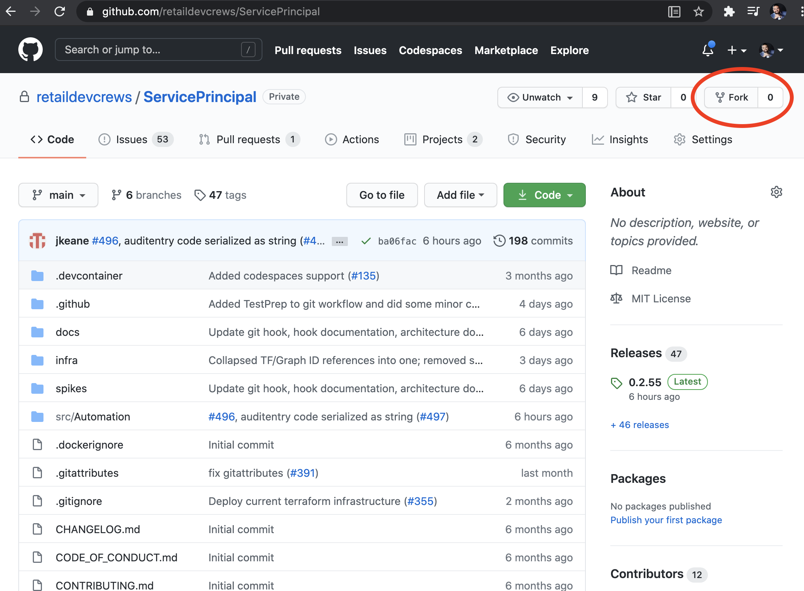

# First Time CI / CD Setup

## Prerequisites

- Azure subscription with admin permissions. Any of the following will suffice:
  - Global Administrator
  - Application Administrator
  - Cloud Application Administrator
- Bash Environment (Following Dependencies Should Be Preloaded if Using Cloud Shell)
  - PowerShell ([download](https://docs.microsoft.com/en-us/powershell/scripting/install/installing-powershell?view=powershell-7.1))
  - Azure CLI ([download](https://docs.microsoft.com/en-us/cli/azure/install-azure-cli?view=azure-cli-latest))
- Infrastructure Setup: [infra/README.md](../infra/README.md)

## Fork Repository

Navigate to [retaildevcrews/ServicePrincipal](https://github.com/retaildevcrews/ServicePrincipal)

In the top-right corner of the page, click Fork.



Place in destination organization

- [ ] Copy URI of new repository to use in next step

Before continuing, nagivate to your forked repository in browser, click on Actions tab and then Enable Github Actions

## Clone Repository To Local

```sh

# Please Note SSH and HTTPS Connection URIs Differ
git clone < ENTER URI TO NEW REPO HERE >

```

## Create Personal Token

Follow steps in this [guide](https://docs.github.com/en/free-pro-team@latest/github/authenticating-to-github/creating-a-personal-access-token) to create a personal access token. This will be used to create and push sensitive tokens used by CICD

For Scopes / Permissions, check "repo" Box

- [ ] Copy token for later prompting

After completing this walkthrough this token can be removed using GitHub UI

## Capture Additional Repo Information

Capture the following information and save for later prompting:

- [ ] Name of ServicePrincipal To Create To Serve As Connection For GitHub Actions. Example: GitHubConnector
- [ ] Github Username
- [ ] Your Github Organization That Contains Repository
- [ ] Your Github Repository Name

## Run Script to Create SP Connection and Push Secrets

```sh

# The Following Command Is Not Needed If Using Azure Cloud Shell
az login

chmod +x infra/cicd/cicd-setup.sh

# Enter Previously Captured Information When Script Prompts
infra/cicd/cicd-setup.sh

```

## First GitHub Action Run

```sh

code .github/workflows/dockerCI.yml

# Replace Value of jobs.build.env.RESOURCE_GROUP with Resource Group Created By Infrastructure Scripts (Can Also Be Retreived From portal.azure.com)

# Save File

# Stage and Commit
git add .
git commit -m "First Push"

# If Following Push Fails, Set Email and Name and Try Again
git push

```

Navigate to your Github Repository and Click on Actions Tab

You should see a new workflow was kicked off after you pushed your changes

## Getting Upstream Updates

You may periodically want to pull updates from the original repository.

To do that you can sync your fork with the upstream repository.

```sh

# You may need to switch out upstream URI if connecting to GitHub via SSH
git remote add upstream https://github.com/retaildevcrews/ServicePrincipal.git

git fetch upstream

git checkout main

git merge upstream/main

git push

```
