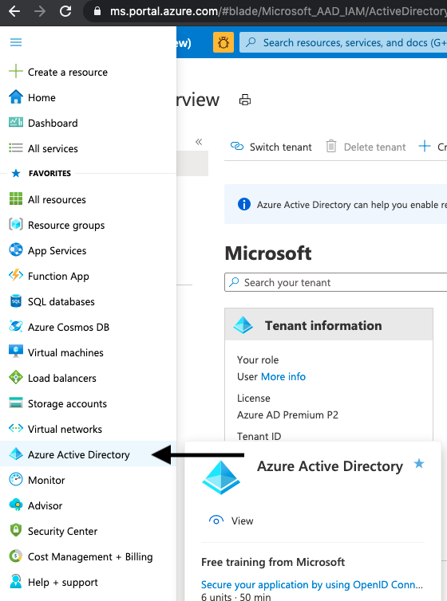

# Service Principal Classification Utility Script

## Purpose

Small script which enables users to export Service Principals from selected Azure Active Directory.

Script will export Service Principals with classification metadata produced by following configurations contained in `scripts/ServicePrincipalClassification/resources`.

`scripts/ServicePrincipalClassification/resources/classification_mapping.json` is preconfigured to capture well known microsoft applications.

`scripts/ServicePrincipalClassification/resources/category_oobe_list.json` is preconfigured to categorize microsoft applications as Out Of Box Experience (OOBE) when their ApplicationId matches list of Service Principals created by default with a new Azure Active Directory resource.

This script is expected to be part of an iterative and manual process to aid customers classifying Service Principals.

## Prerequisites

- Shell Environment (Following Dependencies Should Be Preloaded if Using Cloud Shell)
  - PowerShell ([download](https://docs.microsoft.com/en-us/powershell/scripting/install/installing-powershell?view=powershell-7.1))
  - Azure CLI ([download](https://docs.microsoft.com/en-us/cli/azure/install-azure-cli?view=azure-cli-latest))

## Steps Before Running Script

```pwsh

install-module Microsoft.Graph

az login

cd scripts/ServicePrincipalClassification

```

## Options When Running

### Summary Mode Only

`./Classification.ps1`

### Export Results To CSV (Default File Type)

`./Classification.ps1 temp.csv`

OR

`./Classification.ps1 -OutputFile temp.csv`

OR

`./Classification.ps1 -OutputFile temp.csv -OutputType csv`

### Export Results to TSV (Tab Separated Values)

`./Classification.ps1 -OutputFile temp.tab -OutputType tsv`

### Export Results to JSON

`./Classification.ps1 -OutputFile temp.json -OutputType json`

### Export Results to PowerShell Variable

`$results = ./Classification.ps1 -PassThru`

## Configuration

### How To Update Tenant ID In Classification Mapping

1. Login to [Azure Portal](http://portal.azure.com)
2. 
3. Copy Tenant ID Into Classification Mapping
   1. Open ./classification_mapping.json
   2. Find Tenant Classification Section
   3. Replace `Application, 9c26242b-1b00-450c-98b0-a31412ad5a0e` with `Application, <Insert Copied ID>`

### Additional Configuration To Classification Mapping

After running classification script, you may want to take output from manual classification and feed it back into script.

You can do so by adding Match Criteria. Match Criteria are formatted as `<ServicePrincipalType>, <AppOwnerOrganizationId>`.

Please note a comma is only present if both fields are present.

Null/Empty fields do not have to be included. Example: `ManagedIdentity`

### How To Update OOBE List

This step will probably not have to be run often as default service principals created in an empty Active Directory should not change often

1. Login to [Azure Portal](http://portal.azure.com)
2. [Create Empty Azure Active Directory](https://docs.microsoft.com/en-us/azure/active-directory/fundamentals/active-directory-access-create-new-tenant)
3. Login to Empty Active Directory Through Azure CLI
   - `az login --allow-no-subscriptions --tenant <Tenant Created> -u <Email To Login To Tenant>`
4. Query For Default Service Principals Created (should be less than 100 items)
   - `az ad sp list --query '[].appId' -o json > resources/category_oobe_list.json`
