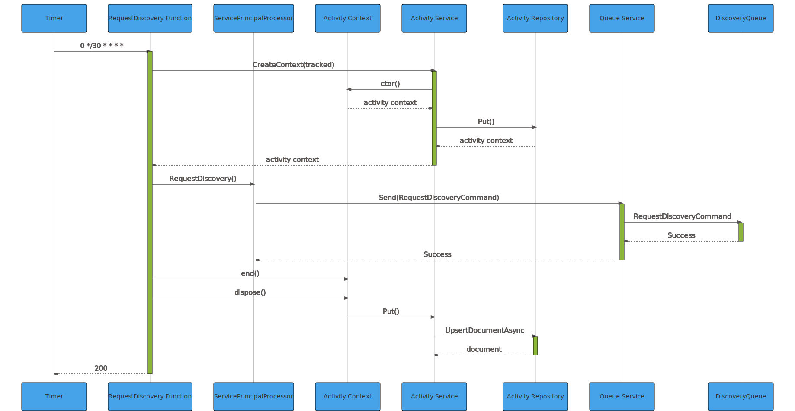
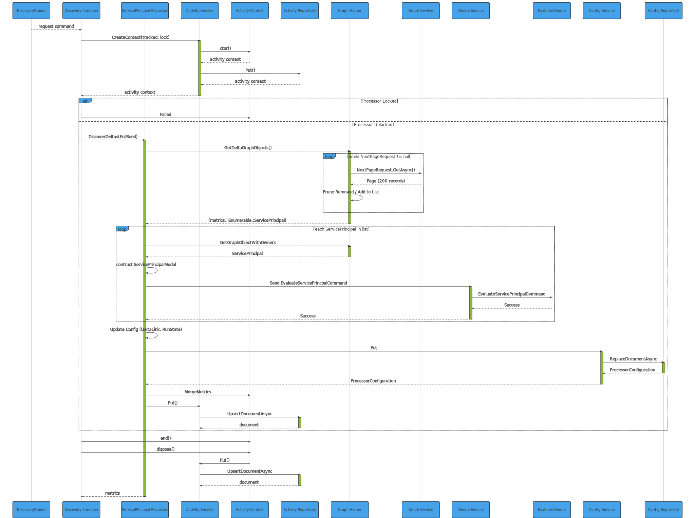

- [Software and Component Architecture](#software-and-component-architecture)
  - [Overview](#overview)
    - [Discovery](#discovery)
    - [Evaluate](#evaluate)
    - [Update](#update)
  - [Logical View](#logical-view)
  - [RequestDiscovery Function (HTTP)](#requestdiscovery-function-http)
  - [DiscoverDeltas Function (Timer)](#discoverdeltas-function-timer)
  - [Discovery Function](#discovery-function)

# Software and Component Architecture
## Overview
The system is built on Azure Functions (v3), Azure Storage Queues and CosmosDB.  

The system is broken down into three major units of work: Discovery, Evaluate and Update.  

### Discovery
The Discovery unit of work is responsible for querying Azure AD (via a Graph API delta query) for any ServicePrincipals that have changed since the last run.  The boundary of this unit of work is either all ServicePrincipals in the Directory that have changed since the last baseline.

A first run or a "force seed" should be considered a baseline.  During a first run any ServicePrincipals that are currently deleted are ignored from consideration. The rationale is that once a ServicePrincipal is deleted, it is immutable and will never have any state changes other than purged from the Directory.

Discovery is triggered via the _discovery_ queue.  Messages are posted into the _discovery_ queue via two Azure functions, **RequestDiscovery** and **DiscoverDeltas**.  The **RequestDiscovery** function is an HTTP triggered function allowing a user or automation to initiate a Full Seed operation.  This may be done as an initial seed activity or to force a reseed of the system.  The Full Seed operation should be viewed as a baseline of the system where changes to ServicePrincipals are monitored from the baseline forward.  The **DiscoverDeltas** function is a Timer trigged function using a configurable schedule that performs the _delta_ query on a predictable schedule.  The default schedule triggers the function on the hour and half hour (0 */30 * * * *).  

For each ServicePrincipal discovered for evaluation, an _evaluate_ message is posted into the **evaluate** queue for the next unit of work.

### Evaluate
The Evaluate unit of work is responsible for performing audit checks against a single ServicePrincipal and if possible, commands an update to the ServicePrincipal in the Directory.  

Evaluate is triggered via the _evaluate_ queue.  The command message contains enough metadata for the ServicePrincipal for audit as well as remediation/update.  If the ServicePrincipal object fails audit, the system will attempt to revert it to a last known good state.  This last known good state is the last time the system detected the object in a PASSing state as tracked in the ObjectTracking Repository.  If a last known good state is not found, the default behavior is use the _Owners_ attribute to update the Notes field.  In either case, if an update to a ServicePrincipal is needed in the Directory, an _update_ message is posted into the **update** queue for the next unit of work.

### Update
The Update unit of work is resonsible for updating a ServicePrincipal in the Directory and recording the last known good state of the object.  

>**Note**: Only the `Notes` field will be updated on the object.  Other housekeeping attributes may be updated by the Directory. (e.g. LastUpdateTime)


## Logical View


## RequestDiscovery Function (HTTP)
<div class="mermaid" id="seq_requestdiscoveryhttp">


<details>
    <summary>Show source code</summary>
        ```mermaid
        sequenceDiagram
            participant C as client
            participant F as RequestDiscovery Function
            participant P as ServicePrincipalProcessor
            participant AC as Activity Context
            participant AS as Activity Service
            participant AR as Activity Repository
            participant QS as Queue Service
            participant DQ as DiscoveryQueue

            C ->>+F: HTTP GET full=true redirect=true
            % Create Activity %
            F ->>+AS: CreateContext(tracked)
            AS ->> AC: ctor()
            AC -->> AS: activity context
            AS ->> AR: Put()
            AR -->> AS: activity context
            AS -->>-F: activity context

            F ->>+P: RequestDiscovery()
            P ->>+QS: Send(RequestDiscoveryCommand)
            QS ->>+DQ: RequestDiscoveryCommand
            DQ -->>-QS: Success
            QS -->>-P: Success

            F ->> AC: end()
            F ->> AC: dispose()
            AC ->> AS: Put()
            AS ->>+AR: UpsertDocumentAsync
            AR -->>-AS: document

            F -->>-C: 200
        ```
</details>
</div>

## DiscoverDeltas Function (Timer)
<div class="mermaid" id="seq_requestdiscoverytimer">


    
<details>
        <summary>Show source code</summary>
        ```mermaid
        sequenceDiagram
            participant C as Timer
            participant F as RequestDiscovery Function
            participant P as ServicePrincipalProcessor
            participant AC as Activity Context
            participant AS as Activity Service
            participant AR as Activity Repository
            participant QS as Queue Service
            participant DQ as DiscoveryQueue

            C ->>+F: 0 */30 * * * *

            % Create Activity %
            F ->>+AS: CreateContext(tracked)
            AS ->> AC: ctor()
            AC -->> AS: activity context
            AS ->> AR: Put()
            AR -->> AS: activity context
            AS -->>-F: activity context

            F ->>+P: RequestDiscovery()
            P ->>+QS: Send(RequestDiscoveryCommand)
            QS ->>+DQ: RequestDiscoveryCommand
            DQ -->>-QS: Success
            QS -->>-P: Success

            F ->> AC: end()
            F ->> AC: dispose()
            AC ->> AS: Put()
            AS ->>+AR: UpsertDocumentAsync
            AR -->>-AS: document

            F -->>-C: 200
        ```
</details>
</div>


## Discovery Function
<div class="mermaid" id="seq_discoveryfunction">



<details>
    <summary>Show source code</summary>
        ```mermaid
        sequenceDiagram
            participant DQ as DiscoveryQueue
            participant F as Discovery Function
            participant P as ServicePrincipal Processor
            participant AS as Activity Service
            participant AC as Activity Context
            participant AR as Activity Repository
            participant GH as Graph Helper
            participant GS as Graph Service
            participant QS as Queue Service
            participant EQ as Evaluate Queue
            participant CS as Config Service
            participant CR as Config Repository


            DQ -->>F: request command

            % Create Activity %
            F ->>+AS: CreateContext(tracked, lock)
            AS ->> AC: ctor()
            AC -->> AS: activity context
            AS ->> AR: Put()
            AR -->> AS: activity context
            AS -->>-F: activity context

            alt Processor Locked
                F ->> AC: Failed
            else Processor Unlocked
                F ->>+P: DiscoverDeltas(FullSeed)
                P ->>+GH: GetDeltaGraphObjects()
                loop while NextPageRequest != null
                GH ->> GS: NextPageRequest.GetAsync()
                GS -->> GH: Page (200 records)
                GH ->> GH: Prune Removed / Add to List
                end
                GH -->>-P: (metrics, IEnumerable::ServicePrincipal)


                loop each ServicePrincipal in list
                P ->>+GH: GetGraphObjectWithOwners
                GH -->>-P: ServicePrincipal
                P ->> P: contruct ServicePrincipalModel
                P ->>+QS: Send EvaluateServicePrincpalCommand
                QS ->> EQ: EvaluateServicePrincipalCommand
                EQ -->>QS: Success
                QS -->>-P: Success
                end
                P ->> P: Update Config (DeltaLink, RunState)
                P ->>+CS: Put
                CS ->>+CR: ReplaceDocumentAsync
                CR -->>-CS: ProcessorConfiguration
                CS -->>-P: ProcessorConfiguration

                P ->> AC: MergeMetrics
                P ->> AS: Put()
                AS ->>+AR: UpsertDocumentAsync
                AR -->>-AS: document
            end

            F ->> AC: end()
            F ->> AC: dispose()
            AC ->> AS: Put()
            AS ->>+AR: UpsertDocumentAsync
            AR -->>-AS: document

            P -->>-F: metrics
        ```
    </details>
</div>
