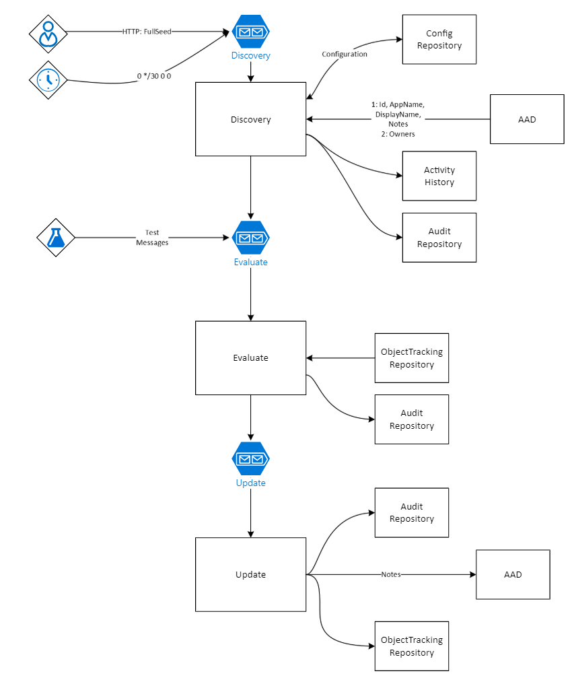

# Software and Component Architecture




# RequestDiscovery Function (HTTP)
<div class="mermaid" id="seq_requestdiscoveryhttp">
    <details>
        <summary>Show source code</summary>
        ```mermaid
        sequenceDiagram
            participant C as client
            participant F as RequestDiscovery Function
            participant P as ServicePrincipalProcessor
            participant AC as Activity Context
            participant AS as Activity Service
            participant AR as Activity Repository
            participant QS as Queueu Service
            participant DQ as DiscoveryQueue

            C ->>+F: HTTP GET full=true redirect=true
            % Create Activity %
            F ->>+AS: CreateContext(tracked)
            AS ->> AC: ctor()
            AC -->> AS: activity context
            AS ->> AR: Put()
            AR -->> AS: activity context
            AS -->>-F: activity context

            F ->>+P: RequestDiscovery()
            P ->>+QS: Send(RequestDiscoveryCommand)
            QS ->>+DQ: RequestDiscoveryCommand
            DQ -->>-QS: Success
            QS -->>-P: Success

            F ->> AC: end()
            F ->> AC: dispose()
            AC ->> AS: Put()
            AS ->>+AR: UpsertDocumentAsync
            AR -->>-AS: document

            F -->>-C: 200
        ```
    </details>
</div>

# DiscoverDeltas Function (Timer)
<div class="mermaid" id="seq_requestdiscoverytimer">
    <details>
        <summary>Show source code</summary>
        ```mermaid
        sequenceDiagram
            participant C as Timer
            participant F as RequestDiscovery Function
            participant P as ServicePrincipalProcessor
            participant AC as Activity Context
            participant AS as Activity Service
            participant AR as Activity Repository
            participant QS as Queueu Service
            participant DQ as DiscoveryQueue

            C ->>+F: 0 */30 * * * *

            % Create Activity %
            F ->>+AS: CreateContext(tracked)
            AS ->> AC: ctor()
            AC -->> AS: activity context
            AS ->> AR: Put()
            AR -->> AS: activity context
            AS -->>-F: activity context

            F ->>+P: RequestDiscovery()
            P ->>+QS: Send(RequestDiscoveryCommand)
            QS ->>+DQ: RequestDiscoveryCommand
            DQ -->>-QS: Success
            QS -->>-P: Success

            F ->> AC: end()
            F ->> AC: dispose()
            AC ->> AS: Put()
            AS ->>+AR: UpsertDocumentAsync
            AR -->>-AS: document

            F -->>-C: 200
        ```
</details>
</div>


# Discovery Function
<div class="mermaid" id="seq_discoveryfunction">

<details>
    <summary>Show source code</summary>
        ```mermaid
        sequenceDiagram
            participant DQ as DiscoveryQueue
            participant F as Discovery Function
            participant P as ServicePrincipal Processor
            participant GH as Graph Helper
            participant GS as Graph Service
            participant QS as Queue Service
            participant EQ as Evaluate Queue
            participant CS as Config Service
            participant CR as Config Repository
            participant AS as Activity Service
            participant AC as Activity Context
            participant AR as Activity Repository

            DQ -->>F: request command

            % Create Activity %
            F ->>+AS: CreateContext(tracked, lock)
            AS ->> AC: ctor()
            AC -->> AS: activity context
            AS ->> AR: Put()
            AR -->> AS: activity context
            AS -->>-F: activity context

            alt Processor Locked
                F ->> AC: Failed
            else Processor Unlocked
                F ->>+P: DiscoverDeltas(FullSeed)
                P ->>+GH: GetDeltaGraphObjects()
                loop while NextPageRequest != null
                GH ->> GS: NextPageRequest.GetAsync()
                GS -->> GH: Page (200 records)
                GH ->> GH: Prune Removed / Add to List
                end
                GH -->>-P: (metrics, IEnumerable::ServicePrincipal)


                loop each ServicePrincipal in list
                P ->>+GH: GetGraphObjectWithOwners
                GH -->>-P: ServicePrincipal
                P ->> P: contruct ServicePrincipalModel
                P ->>+QS: Send EvaluateServicePrincpalCommand
                QS ->> EQ: EvaluateServicePrincipalCommand
                EQ -->>QS: Success
                QS -->>-P: Success
                end
                P ->> P: Update Config (DeltaLink, RunState)
                P ->>+CS: Put
                CS ->>+CR: ReplaceDocumentAsync
                CR -->>-CS: ProcessorConfiguration
                CS -->>-P: ProcessorConfiguration

                P ->> AC: MergeMetrics
                P ->> AS: Put()
                AS ->>+AR: UpsertDocumentAsync
                AR -->>-AS: document
            end

            F ->> AC: end()
            F ->> AC: dispose()
            AC ->> AS: Put()
            AS ->>+AR: UpsertDocumentAsync
            AR -->>-AS: document

            P -->>-F: metrics
        ```
    </details>
</div>

