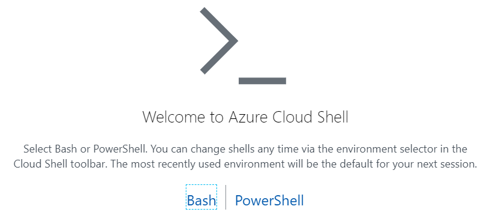
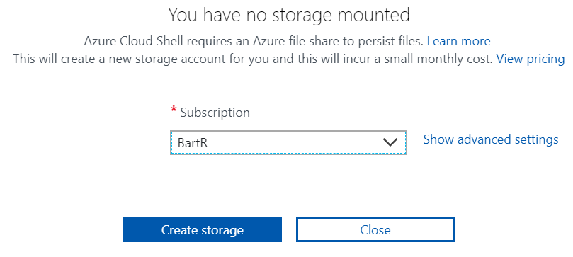
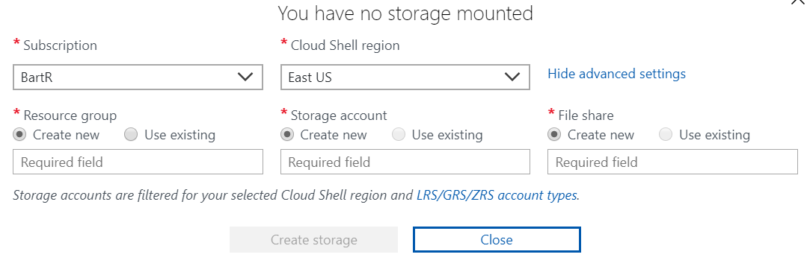

# Cloud Shell Setup

Launch the Azure Portal <https://portal.azure.com>

Click on the Cloud Shell icon in the top header (>_)

If this is the first time you've used Cloud Shell you will see this:



* Click on Bash

You will see this:



* Select your subscription
* Click Show Advanced Settings

You will see this:



* Select the Region
* Select or create the Resource Group
* Select or create the Storage Account
* Select or create the File Share

## Configure ssh

On your local development machine, find or generate your SSH keys.

```bash

# Make sure you're in your home directory
cd ~

# Check for existing .ssh folder
ls -al ~/.ssh

# if it doesnt already exist, create an .ssh folder 
mkdir .ssh

cd .ssh
ll

###### If id_rsa already exists, do NOT run this command!

# Generate the keys using your GitHub email address
# Hit enter twice to set an empty passphrase
ssh-keygen -t rsa -f ./id_rsa -C "your_email@example.com"

######

```

Go back to your browser with Azure Cloud Shell.

Click on the "Upload/Download files" button and select the newly generated id_rsa and id_rsa.pub. (You will have to do this once per file)

```bash

# In Azure Cloud Shell, you should see your uploaded keys in the home dir.
cd ~
ll

# Move the keys to the .ssh folder
mv id_rsa id_rsa.pub .ssh/

# Set the right (owner read+write) permissions for the keys
chmod 600 ~/.ssh/id_rsa.pub
chmod 600 ~/.ssh/id_rsa

```

## Add SSH key to your GitHub account

Run the following command

```bash
cat ~/.ssh/id_rsa.pub
```

Copy the output (starts with `ssh-rsa` and ends with the email address you supplied when generating the key).

Go to https://github.com/settings/keys in your browser and click new key. Paste in the output from `id_rsa.pub`

Run the following to test your new SSH connection to GitHub.

```bash
ssh -T git@github.com
```

You should get a message similar to this one:

```
Warning: Permanently added the RSA host key for IP address '140.82.112.3' to the list of known hosts.
Hi atxryan! You've successfully authenticated, but GitHub does not provide shell access.
```


### Done!